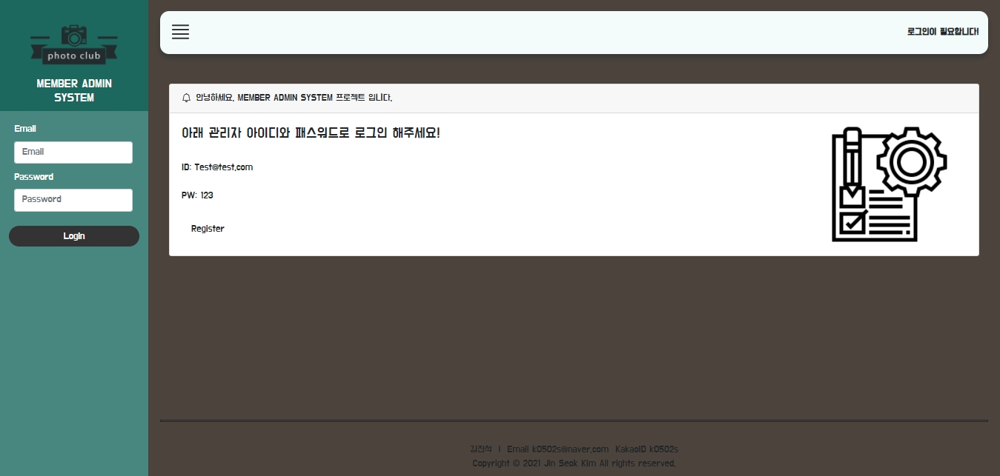
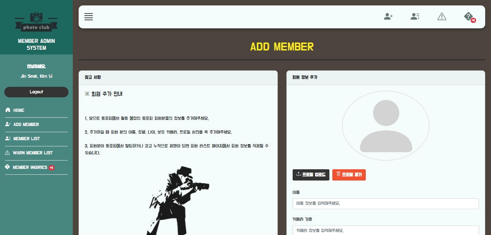
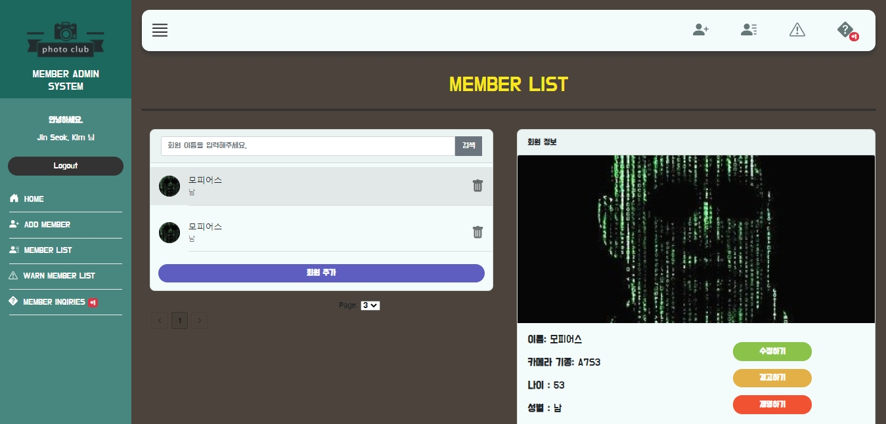
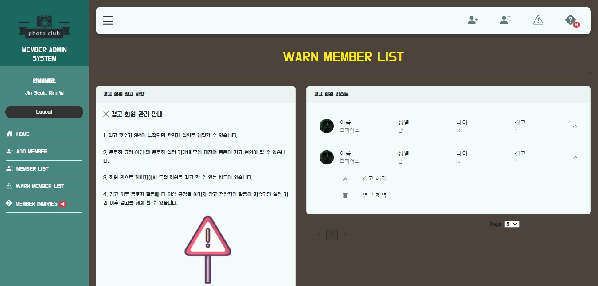
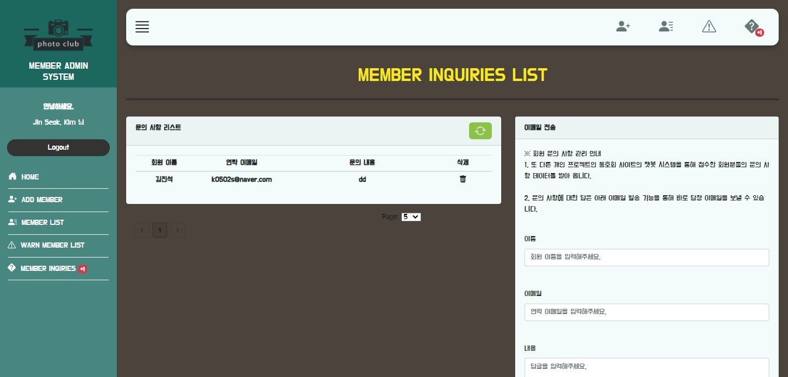
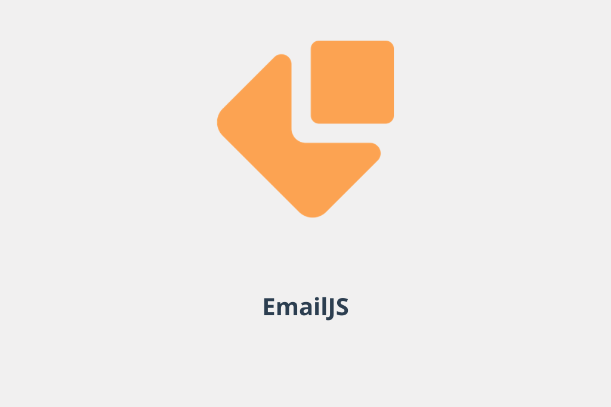

# Member-Admin-System

  

#### [웹사이트 방문하기](https://member-admin-system.herokuapp.com)

## 프로젝트 소개

사진 동호회가 실제로 운영되고 회원 수가 많아진다면 회원들을 더 직관적이고 효율적으로 관리하기 위한 ADMIN 시스템 사이트를 제작하였습니다. 회원들의 정보를 추가, 삭제, 조회, 수정 할 수 있는 CRUD 기능과 더불어 특정 회원을 경고, 경고 누적, 경고 회원 조회 및 경고 해제 할 수 있는 기능 또한 제공하고 있습니다. 추가로 실제 [사진 동호회 사이트](https://github.com/k0502s/Photo-Club)의 다음 모임 장소를 표시하는 지도 API 정보를 관리자 권한으로 데이터를 업데이트 할 수 있는 기능과 동호회 사이트의 챗봇에서 받아온 회원들의 문의 사항 데이터 또한 받아와 view로 직관적으로 보여주는 등 정말로 회원들을 관리하게 된다면 어떻게 효율적으로 편리하게 할 수 있을지 고민하며 떠오른 기능들을 실제로 스스로 구현해보는 시간을 갖게된 뜻 깊은 프로젝트였습니다. 

 

## 웹사이트 화면

|             홈(로그인 전)              |           홈(로그인 후)            |
| :-------------------------: | :---------------------------: |
|  |  |

|           회원 정보 추가             |            회원 리스트            |
| :---------------------------: | :--------------------------: |
|  |  |

|             경고 회원 리스트              |              문의 사항              |
| :---------------------------: | :--------------------------: |
|  |  |

 

## 기술 스택

|               UI 라이브러리                |                      상태 관리                       |                  비동기 상태 관리                   |                스타일링                 |
| :----------------------------------------: | :-----------------------------------------------: | :----------------------------------------: | :---------------------------------------------: |
|  |  |  |  |

|                        서버                        |                        DB                        |                        JS Superset                        |                         테스트 코드                        | 
|:----------------------------------------------------: | :---------------------------------------: | :---------------------------------------------------------: | :--------------------------------------------: |
|  |  |  |  |

|                오픈 API-1                  |                 오픈 API-2                  |
| :-----------------------------------------: | :---------------------------------------: |
|  |  |

 

## UI 라이브러리와 상태 관리 - React.js와 Redux, Redux-Saga

 * 프로젝트를 진행하면서 UI 라이브러리로 React.js을 사용하였습니다. React.js을 사용한 이유로 처음으로 배운 UI 라이브러리이기도 하였으며 제일 많이 쓰이는 라이브러리라고 알고 있었기 때문이었습니다. 프로젝트를 통해 왜 React.js을 쓰는지 알게된 점이 가장 큰 의미가 있었습니다. React.js을 쓰면서 실제 실무에서 생상성이 확실히 좋을 것이라는 느낌을 받았습니다. 앞으로 React.js에 익숙해진다면 더욱 생상성의 시너지가 붙을 것 같다고도 생각하게 되었습니다. 특히 함수형 Hook을 사용하면서 React.js는 더욱 직관적인 개발을 할 수 있게 되었다고 생각하며 앞으로의 React.js 전망은 유망하다고 생각합니다.

 * Redux, Redux-Saga의 비동기 상태 관리는 React.js의 생상성을 더욱 더 높여주는 스킬이었습니다. 처음에 이 스킬을 공부하고 나서 워낙 낯선 개념이기도 하였고 헷갈리는 스킬이라고 생각하여 프로젝트를 하기 전에는 Redux을 왜 써야하는지 느낌을 받지 못하고 있었습니다. 초반에 세팅할 것도 많고 오류가 많이 등장하여 익숙해지는데 끙끙 앓았던 것 같았습니다. 하지만 프로젝트를 통해 Redux, Redux-Saga을 투입하여 사용해본 결과 실제 실무에서 스케일이 큰 프로젝트에서는 확실히 필요한 스킬이라고 깨닫게 되었습니다. 비록 개인 프로젝트에서는 Redux 상태관리가 불필요할지는 몰라도 스케일이 큰 프로젝트의 깊숙이 뿌리내린 수 많은 컴포넌트들이 있다면 Redux 상태관리는 필수라고 생각합니다.

 

## 스타일링 - Styled-Components과 Reactstrap, material-ui

* CSS 스타일링을 위해 Styled-Components을 사용하였습니다. 프로젝트를 진행하기 전에는 CSS는 CSS 그 자체로 혹은 Sass을 이용하여 스타일링을 하였지만 이번 프로젝트에서는 컴포넌트를 CSS-in-JS 방식으로 스타일링 하는 Styled-Components을 활용한 방식을 메인으로 사용하였습니다. 사실 처음에는 CSS-in-JS 방식이 낯설어 익숙한 CSS나 Sass을 쓸까 생각하기도 하였지만 이번 프로젝트로 Styled-Components을 통한 CSS-in-JS 방식에 익숙해지자 React.js 환경에서 보통 CSS나 Sass보다 Styled-Components이 훨씬 가독성이 좋으며 추후 유지보수 측면에서 우의를 차지하고 있다고 생각하게 되었습니다. 그만큼 사용할 수 있으면 매우 효율적이고 훌륭한 스킬이라고 알게되었습니다. 특히 React.js 환경에서 props을 활용한 CSS 스타일링은 개발하면서 정말 마음에든 스킬이었습니다.

* 더 높은 생상성을 위하여 CSS 라이브러리를 활용하기도 하였습니다. Reactstrap과 material-ui을 활용하였습니다. 레이아웃이라든지 간단한 Box 카드, Button 등등을 라이브러리를 통하여 더욱 빠르게 스타일링 할 수 있는 경험을 해보게 되었습니다. 특히 아직 부족한 실력에 레이아웃을 설계하는데 힘이 들었는데 라이브러리의 도움을 많이 받아 원활하게 원하는 view을 얻을 수 있었습니다. 특히 모바일 디바이스의 레이아웃 대응에도 매우 도움이 되었습니다.

 

## 서버와 DB - Node.js + Express와 MongoDB

* 서버는 JS을 통해 서버를 구축할 수 있는 Node+Express을 활용하였습니다. 프론트엔드를 희망하는 저는 JS 위주의 언어를 공부하였기에 JS로만 서버를 구축할 수 있다는 것에 메르트가 있다고 생각하여 프로젝트를 완성하는데 선택하게 되었습니다. 간단한 CRUD Restful API을 작성해보는 경험을 하게되었습니다. 그리고 클라이언트와 연동해보며 CROS 정책에 관한 이해와 대처 방법 또한 경험해보며 실제 실무에서 프론트엔드로서 백엔드 개발자분들과 원활한 협업과 소통이 되기 위한 역량을 조금이나마 쌓게 되었다고 생각합니다. 실제 웹의 데이터가 어떤 사이클로 작동하는지 확실히 이해하게된 뜻 깊은 스킬 경험이었습니다. 특히 JS의 비동기 문법이 제일 많이 사용하게 되어 비동기 문법에 대해서도 공부 및 이해 하는데 매우 도움이 되었습니다.

* DB는 프로젝트를 시작하기 전 MySql과 MongoDB 둘 중 어떤 종류의 DB을 써볼까 고민했었습니다. 결국 MongoDB을 선택하였습니다. Mysql이 기본이고 많이 쓰인다고 들었지만 MongoDB는 Document로 데이터를 저장하며 더 다향하게 데이터 타입을 헨들링할 수 있어 빠르게 프로젝트에 적용할 수 있다는 장점에 마음이 이끌렸습니다. 또 앞으로 많은 기업들이 Document 객체 지향과 조합이 좋아 편리하기 때문에 많이 선택 스킬로 채택된다는 소식을 듣게 되어 써봐야겠다고 확신하게 되었습니다. 아주 기초적이지만 DB의 기본 메서드들을 활용하며 CRUD 쿼리들을 만들어내는 것에 재미를 느끼기고 하였습니다. 하지만 워낙 다양한 메서드들과 사용 방법들이 있어 이 방대한 사용 설명서를 어렵게 검색하여 찾아보는 경험과 때로는 알 수 없는 오류에 부딫히는 어려움을 겪기도 하였습니다.

 

## JS Superset - TypeScript

* 처음부터 언어를 JS을 공부한 저는 타입지정이라는 개념에 매우 생소하였습니다. TypeScript을 공부하고 이번 프로젝트에서 사용해보면서 JS에 타입을 왜 지정해야 되고 활용해야 하는지 이해하게 되었습니다. 사실 TypeScript가 없어도 프로젝트를 진행하는데 지장이 없었지만 일부러 TypeScript을 적용해보면서 왜 써야되고 개발에 어떤 도움이 되는지 직접 느껴보는 계기가 되었다는 것에 의미를 두게 되었습니다. 사실 TypeScript을 적용하면서 코드의 량이 늘어나고 일일이 타입을 지정하는데 꽤나 귀찮은 일이었던 것을 사실이었습니다. 하지만 개인 프로젝트와 같이 스케일이 작은 코드에서는 괜찮겠지만 실제 실무에서 스케일이 커지면 커질 수록 타입을 지정했기 때문에 미처 발견하지 못한 오류에 대응할 수 있게 되며 오히려 이러한 오류 방지로 디버깅으로 인한 생산성 저하를 미리 예방할 수 있다는 것에 큰 의미를 갖고 있다는 것을 깨닫게 되었습니다.

* 아직 기본적인 TypeScript 문법 활용만이 가능하고 100% 모든 코드에 타입을 지정하지 못하는 등 역량이 많이 부족하지만 React.js 환경에 TypeScript을 적용해보며 앞으로 어떤 방식으로 TypeScript을 공부할지 어떤 방향으로 TypeScript에 접근하여 사용할지 알게된 뜻깊은 프로젝트의 경험이었다고 생각합니다.

 

## 테스트 코드 - Jest와 React testing library

* 이번 프로젝트에 테스트 코드 또한 작성하게 되었습니다. 사실 처음에 테스트 코드를 작성하기도 전에 너무 낯선 개념에 작성 전부터 포기할까 생각하기도 한 스킬 적용이었습니다. 지금까지 코드만 짜고 로컬에서 실행시켜 보고 눈으로만 확인하는 테스트로 만족하고 있었지만 아예 실제로 테스트 코드라는 독자적인 코드를 따로 입력하여 테스트를 돌린 다는 개념은 무척 어렵게 느껴졌고 배우면서 어떻게 코드를 작성할지 막막하였던 기억이 있었습니다. 하지만 어떻게 테스트 코드를 작성하여 어떤 식으로 사이클이 돌아가는지 한번 익숙해지니 쭉 나아가게 된 스킬 적용이었습니다. 확실히 테스트 코드를 작성하는 것이 프로젝트가 테스트를 하지 않았을 때보다 견고해진다는 것을 느끼게 되었습니다. 실제 실무에서도 이러한 테스트가 있다면 생산성이 방해되는 디버깅을 피할 수 있고 미리 예방할 수 있다는 것에 좋을 것 같다고 생각하게 되었습니다.

* 테스트 프레임워크로 Jest을 사용하고 react testing library을 사용하여 React 환경에서의 핵심인 DOM 컴포넌트를 중심적으로 테스트 코드 작성에 집중 할 수 있었습니다. Redux 스토어에서 컴포넌트가 잘 랜더링 되는지, Redux의 액션 및 리듀서가 상태를 잘 업데이트하고 잘 랜더링하는지, React 라우터가 잘 작동하는지 등 기능적인 부분들을 테스트하는 경험을 하게 되었습니다. 솔직히 아직 모르는 많은 테스트 코드 문법이 존재하고 실제 실무에서도 빠르게 코드를 작성할 수 있는 역량까지 도달했다고 말할 수는 없다고 생각하여 개인 프로젝트를 통한 테스트 코드 경험은 앞으로 어떤 방향으로 테스트 코드 작성에 대한 공부에 접근할 수 있는지 알아보았다고 말하고 싶습니다. 

 

## 오픈 API- KakoMap과 EmailJs

* 오픈 API을 적용하는 경험 또한 하게 되었습니다. 아주 간단한 API 적용이었지만 간단한 경험을 통해 다른 API 적용에 겁을 먹지 않을 수 있다는 역량을 갖게 되었다고 말하고 싶습니다. 이 프로젝트에서 적용한 오픈 API는 KakiMap과 EmailJS입니다.

* KakoMap을 통해 이 프로젝트에서는 다른 프로젝트인 [사진 동호회 사이트](https://photo-club-korea.herokuapp.com)의 다음 모임 장소 지도 데이터를 업데이트 할 수 있도록 스스로 오픈 API 데이터를 클라이언트와 서버 및 DB을 활용하여 나만의 기능을 만들어 내는 뜻 깊은 경험을 하게 되었습니다.

* EmailJs는 매우 간단한 오픈 API로 이메일을 이 오픈 API을 통해 곧바로 Form을 통해 보낼 수 있는 기능 활용할 수 있게끔 구현하는데 도움을 받게 되었습니다. 실제 [사진 동호회 사이트](https://photo-club-korea.herokuapp.com)에서 챗봇으로 받은 문의 사항 데이터를 보고 문의 사항을 보낸 해당 회원의 연락 이메일을 보고 효율적으로 문의 사항에 대한 답장을 할 수 있도록 하기 위함이었습니다.

 